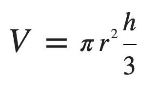

## CS-UY 1114 — Lab 3
# Operators and Basic Debugging
#### February 19th, 2021


All lab work must be submitted within 24 hours of the start of your lab period on Gradescope (we will be checking this
using the timestamps of your last submission on GradeScope). This, of course, also means that if you submit a solution
before your allotted lab time, you will get no credit. You must try each problem at least once (that is, submitting at
least one attempt to GradeScope, whether it is correct or not). You are welcome to continue to work on the problems and
continue submitting to Gradescope until you are satisfied with your results. It is your responsibility to remember to
submit your work.

Please note that your overall point value is awarded by the teaching assistants verifying that you attempted and
submitted each problem at least once! For every hour that your work is late on GradeScope, we will deduct 0.5 points
from the total 10-point value of the lab.

### Restrictions

The Python structures that you use in this lab should be restricted to those you have learned in lecture so far. Please
check with your teaching assistants in case you are unsure whether something is or is not allowed!

### Problem 1: The Volume of a Cone

As usual, let's start off with some simple stuff. In the file **[cone_volume.py](cone_volume.py)**, create a function
**`print_cone_volume()`**, that will include and use _any **positive**_ values for the variables needed to calculate the
volume of a cone: its height and the radius of its base. The formula looks as follows:



_**Figure 1**: Formula for the volume of a cone with a circular base._

Your program will then calculate the resulting volume and print it out to the user in **exactly** the following way:

```python
def main():
   print_cone_volume()  # assumes value of 3 for the radius, and a value of 4.5 for the height

main()
```
Output:
```text
The volume of a cone with a radius of 3 and a height of 4.5 is 42.4116.
```

If either the value of the radius or the value of the height is negative, your program must **instead** print the
following message:

```python
def main():
   print_cone_volume()  # assumes value of -3.0 for the radius, and a value of 4.5 for the height

main()
```
Output:
```text
The values of the radius and the height must be positive.
```

For this problem, you may assume that the value of pi is 3.1416. Again, **your function must work for any and all
numerical values for the radius and height.** You needn't worry about units either; you can assume the units of both
values don't require any additional conversions.

### Problem 2: [Insert Witty Calculator Title Here]

For this program,a function called **`print_arithmetic_information()`** is defined in the file
[**arithmetic_information.py**](arithmetic_information.py). We simply want to print the result of the 5 main
main arithmetic operations between two **positive integers**: sum, difference, product, and quotient, and remainder.

Here's an example:

```python
def main():
   print_arithmetic_information()  # the values of the two numbers in this example are 10 and 4

main()
```
Output:
```text
14
6
40
2 
2
```
A couple of things to note here:
- If either of the values are negative, your program should print the following message: `Values must be positive.`
- You may assume values will always be integers.

### Problem 3: Curb your (graduation) privilege.

This problem will focus on  **debugging**. You may have heard the word before, and for good reason:
knowing how to debug properly is one of the most important skills in any programmer's toolbox.

In computer programming and software development, debugging is the process of finding and resolving bugs (defects
or problems that prevent correct operation) within computer programs
([**source**](https://en.wikipedia.org/wiki/Debugging)). While some bugs can be identified by simply reading your
code, as programs get longer and more complex, more often than not you will end up debugging your programs using
several sample values, observing the resulting behavior, and then checking if you are getting the expected results.
Throughout the semester, we will sprinkle in debugging programs in the labs every now and then to get you used to the
practice. Of course, as this is the first one, it will be relatively simple:

The program you will be debugging is simple; it basically prints `True` if a student meets the requirements needed
to graduate, and `False` if not. The requirements are as follows:

A student may graduate if:
- They have accumulated 64 credits **and** are approved seniors, or:
- They have accumulated 40 credits **and** have special permission from their advisor, or:
- They have special permission from the dean to graduate, regardless of how many credits they have.

You may find the buggy version of this program in the file [**graduation_status.py**](graduation_status.py), under the
function **`print_graduation_status()`**. Once you fix all the bugs in the program, your program must behave as follows:

- _Example 1_:
```python
def main():
   """
   Assuming the following values inside print_graduation_status:
       has_dean_permission = False
       has_advisor_permission = False
       is_approved_senior = True
       accumulated_credits = 20
   """
   print_graduation_status()

main()
```
Output:
```text
This student cannot graduate.
```

- _Example 2_:
```python
def main():
   """
   Assuming the following values inside print_graduation_status:
       has_dean_permission = False
       has_advisor_permission = False
       is_approved_senior = True
       accumulated_credits = 65
   """
   print_graduation_status()

main()
```
Output:
```text
This student can graduate.
```

- _Example 3_:
```python
def main():
   """
   Assuming the following values inside print_graduation_status:
       has_dean_permission = False
       has_advisor_permission = True
       is_approved_senior = False
       accumulated_credits = 50
   """
   print_graduation_status()

main()
```
Output:
```text
This student can graduate.
```

These are, of course, not the only combinations possible, so give a couple more a try when debugging your program
to make sure that you've covered all the possibilities!

